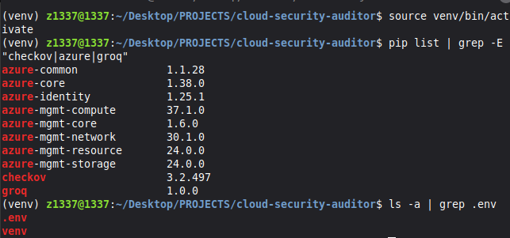
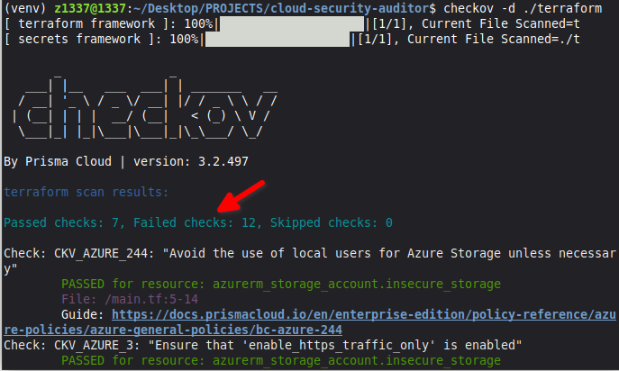
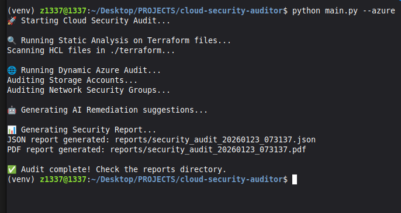
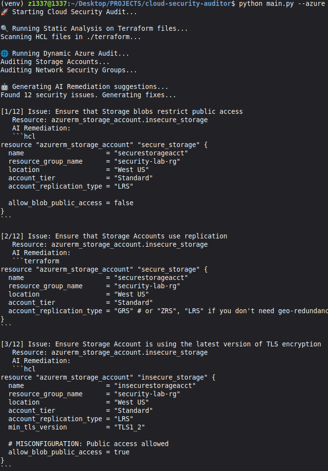
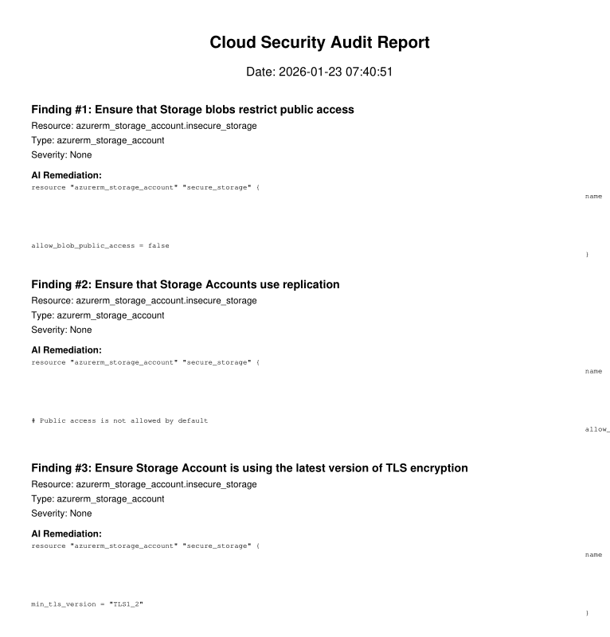

# Cloud Infrastructure Security Auditor

## Project Overview
This project is an automated security auditing tool designed to identify misconfigurations in Infrastructure-as-Code (Terraform) and live Azure environments. It integrates static analysis, dynamic cloud auditing, and AI-driven remediation to streamline the cloud hardening process.

## Key Objectives
- **Static Analysis**: Automated scanning of `.tf` files using `Checkov`.
- **Dynamic Auditing**: Real-time querying of Azure resources (Storage, Network, Compute) for security gaps.
- **AI Remediation**: Automatic generation of "Fix" code using AI models (Groq - Free API).
- **Consolidated Reporting**: Unified security posture reports in JSON and PDF formats.

## Technical Architecture
- **Language**: Python 3.x
- **Infrastructure**: Terraform (HCL)
- **Cloud Provider**: Microsoft Azure
- **Security Tools**: Checkov
- **AI Integration**: Groq API (Free)
- **Reporting**: Pydantic, FPDF2

## Lab Execution & Evidence

### 1. Project Initialization & Environment Setup
The project environment is configured with necessary SDKs and tools.

*Screenshot: Terminal showing `pip install` and environment variable configuration.*

### 2. Static Analysis (Terraform Scanning)
Executing the static analysis engine against a sample Terraform deployment with intentional misconfigurations.

*Screenshot: Checkov output showing failed security checks in Terraform files.*

### 3. Dynamic Auditing (Live Azure Scan)
Connecting to the live Azure environment and auditing resource configurations.

*Screenshot: Python script output listing insecure Azure resources (e.g., Public Blob Storage).*

### 4. AI Remediation Engine
The AI engine analyzes a vulnerability and generates the corrected code snippet.

*Screenshot: Comparison between vulnerable code and AI-generated fix code.*

### 5. Final Security Report
Generation of a comprehensive security report summarizing all findings and recommendations.

*Screenshot: A PDF or JSON report showing the consolidated security posture.*

## How to Use
1. **Clone the repo**: `git clone https://github.com/jacobdcook/cloud-security-auditor`
2. **Create virtual environment**: `python3 -m venv venv`
3. **Activate virtual environment**: `source venv/bin/activate` (you'll see `(venv)` in your prompt)
4. **Install dependencies**: `pip install -r requirements.txt`
5. **Configure Azure CLI**: `az login`
6. **Set Environment Variables**: Create a `.env` file with your AI API keys and Azure subscription ID.
7. **Run the Auditor**: `python main.py` (or `python main.py --azure` for live Azure scanning)

## Learning Outcomes
- Advanced understanding of **DevSecOps** and automated compliance.
- Proficiency in **Cloud Security Hardening** for Azure.
- Integration of **AI/LLMs** into security workflows.
- Experience with **Infrastructure-as-Code (IaC)** security principles.
